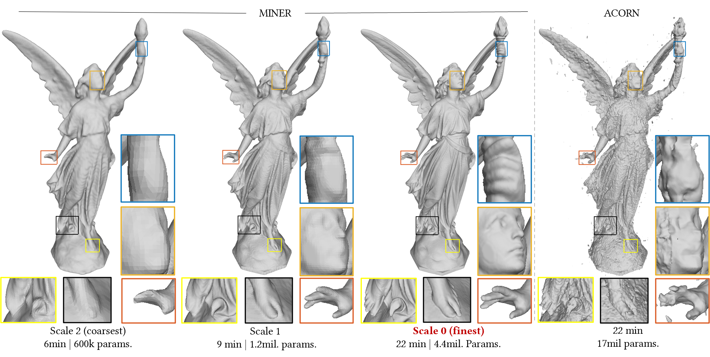

# MINER: Multiscale Implicit Neural Representation



**Abstract**: *We present a novel implicit representation framework called MINER that is well suited for tasks such as fitting very high resolution point clouds ovre multiple levels of detail (LoD). This figure demonstrates fitting of the Lucy 3D mesh over five spatial scales. MINER takes less than half an hour to achieve an intersection over union (IoU) of 0.999 when trained over more than a billion 3D points.*

**Paper**: https://arxiv.org/abs/2202.03532

## Instructions

### Data
Download image and occupancy examples from [here](https://www.dropbox.com/sh/gy0ykfwjvc97gv9/AABUE1QIZSqF4wmUjaR28dbYa?dl=0). Place it in `path/to/this/folder/data/`. 
### Requirements
check `requirements.txt`. This code was tested on python 3.8 in both Windows and Linux environments. Requirements file generated in Linux environment but should work similarly in a Windows environment. Memory consumption statistics work only in Linux environment.
### Running MINER on images
Please check `miner_image.py` for fitting an image. We have included an example image in `data/pluto.png` which is a modified image from the wiki page on Pluto (zero-padded to 8192x8192). 

### Running MINER on volumes
Please check `miner_pointcloud.py` for fitting a 3D shape with occupancy information. For simplicity, we have included occupancy volume of Lucy with regular sampling over 512x512x512 cube. 

### Information about individual files
1. `miner_image.py`: Runs training script for a single image
2. `miner_pointcloud.py`: Runs training script for a uniformly sampled occupancy of a 3D shape
3. `requirements.txt`: All requirements for running scripts in this folder. 
4. `modules`: Contains functions to run the training scripts:

    a. `folding_utils.py`: Fast script for converting image/pointcloud into batches. This version assumes no overlap of patches and hence is much faster than default torch fold

    b.  `losses.py`: Loss functions for training

    c. `miner.py`: Functions required to train images and occupancies with MINER.

    d. `utils.py`: Miscellaneous utilities

    e. `volutils.py`: Utilities for handling volume signals

## Cite

```
@inproceedings{saragadam2022miner,
  title={MINER: Multiscale Implicit Neural Representations},
  author={Saragadam, Vishwanath and Tan, Jasper and Balakrishnan, Guha and Baraniuk, Richard G and Veeraraghavan, Ashok},
  booktitle={European Conf. Computer Vision (ECCV)}
  year={2022}
}
```

